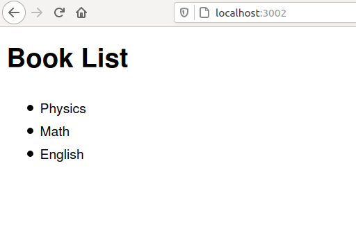

# Microservice_Communication

There are 2 microservices in this project. 

The "book_list" microservice returns a list of books. This service is not exposed to outside world.

The "view_book" microservice prints the book list sent by the "book_list" microservice. This service is exposed to outside world. Only this service can call the "book_list" microservice.

After running this command the services are up and can communicate between them.

```bash

docker-compose up

```
We get the output on localhost's port 3002.

<br> 
 <br> <br>